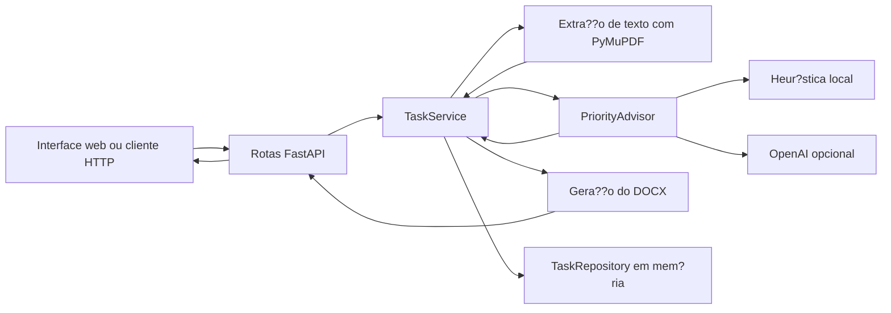

```mermaid
flowchart LR
    U[Interface web ou cliente HTTP] --> R[Rotas FastAPI]
    R --> S[TaskService]
    S --> P[Extra??o de texto com PyMuPDF]
    P --> S
    S --> A[PriorityAdvisor]
    A --> L[Heur?stica local]
    A --> O[OpenAI opcional]
    A --> S
    S --> D[Gera??o do DOCX]
    S --> T[TaskRepository em mem?ria]
    D --> R
    R --> U
```
